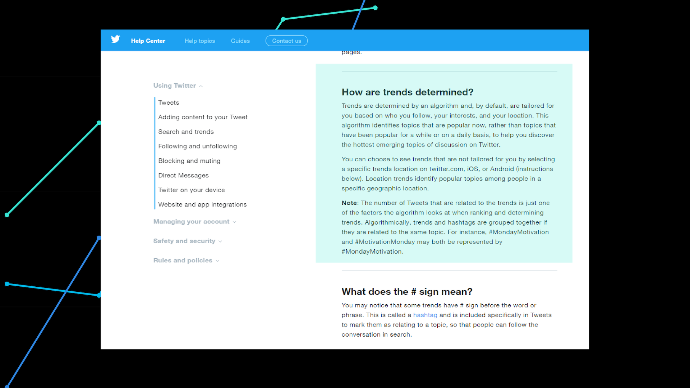
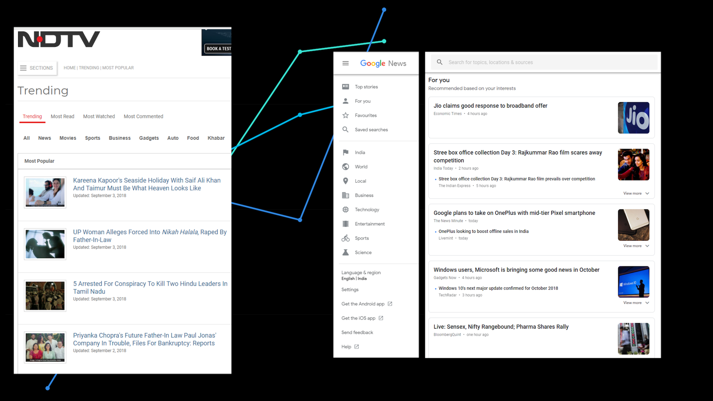
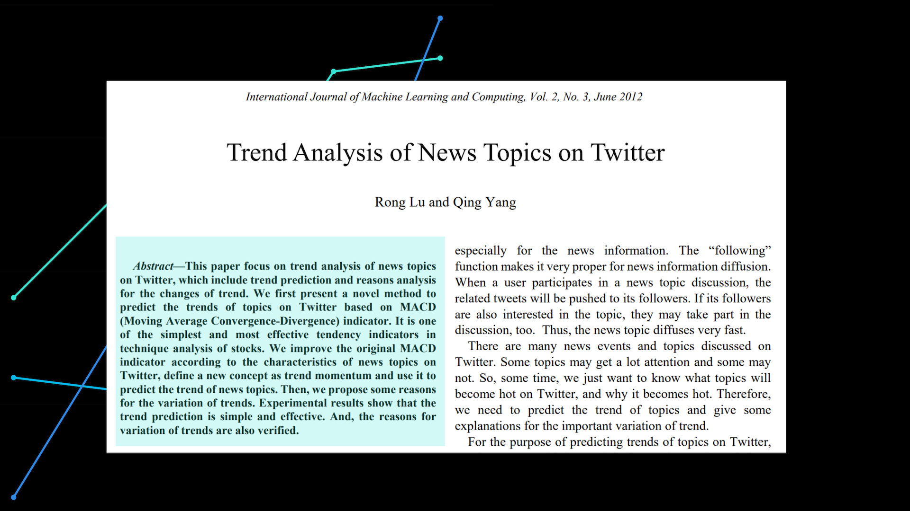

# Inferring top k trends from real time Twitter data

Analyzing twitter data for trend analysis is one of the hot research areas both in industry and academia. The trend analysis so far can broadly be categorized as:
1) User specific trends 
2) Classification of trends.

The first category of trend analysis primarily focuses on individual user activities. However, a user may be willing to see customized trends based on  a)  top k topics, and b) geographical regions. On the other hand, the current work in the second category of trend analysis is limited to classifying trends based on broad topics such as news, ongoing events, memes, commemoratives, etc. However, a user may be interested to know sub-categories in these topics. For example, the sub-categories in topic 'news' could be sports, politics, entertainments, economics, etc. This mini project aims to propose a model that would add the above discussed features in the current trend analysis, and further validate it over the existing twitter trends. 

